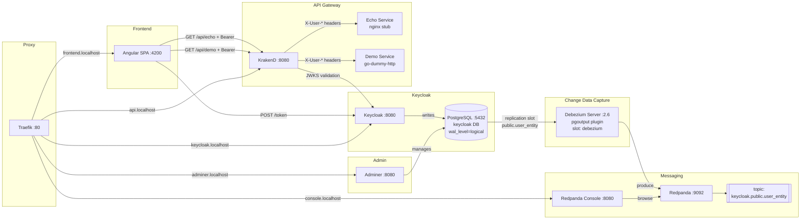

# Small Ecosystem

Demo of a small ecosystem

## Work in progress...

## Architecture



### CDC Event fields

Debezium emits events on `keycloak.public.user_entity` topic. Each message contains only:

| Field      | Description          |
|------------|----------------------|
| `id`       | Keycloak user UUID   |
| `username` | Username             |
| `email`    | Email address        |
| `enabled`  | Account active flag  |
| `__op`     | Operation: `c` create / `u` update / `d` delete |

## Services

| Service          | URL / port                          | Credentials                | Database  |
|------------------|-------------------------------------|----------------------------|-----------|
| Traefik          | http://localhost (reverse proxy)    |                            |           |
| Frontend         | http://frontend.localhost            |                            |           |
| KrakenD          | http://api.localhost                |                            |           |
| Echo Service     | (internal) via KrakenD `/api/echo`  |                            |           |
| Demo Service     | (internal) via KrakenD `/api/demo`  |                            |           |
| Keycloak         | http://keycloak.localhost           | admin / admin              |           |
| Adminer          | http://adminer.localhost            |                            |           |
| Redpanda Console | http://console.localhost            |                            |           |
| Redpanda (Kafka) | localhost:9092                      |                            |           |
| PostgreSQL       | localhost:5432                      | admin / admin (superuser)  | -         |
| PostgreSQL       | localhost:5432                      | keycloak / keycloak        | keycloak  |

Traefik routes HTTP traffic on port 80 based on subdomains. Keycloak and Redpanda Console are not exposed on separate ports — access them through Traefik.
## Usage

```bash
make up    # start all services
make down  # stop all services
```
