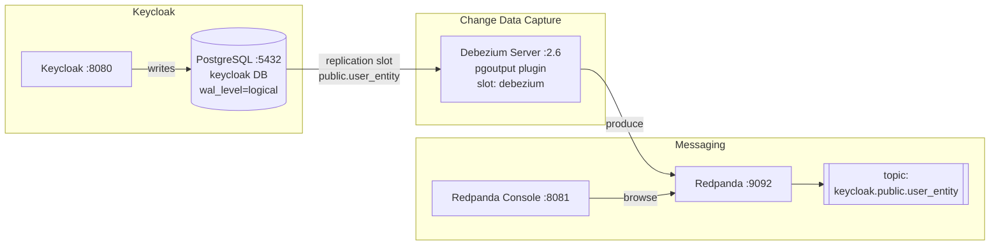

# Small Ecosystem

Demo of a small ecosystem

## Work in progress...

## Architecture



### CDC Event fields

Debezium emits events on `keycloak.public.user_entity` topic. Each message contains only:

| Field      | Description          |
|------------|----------------------|
| `id`       | Keycloak user UUID   |
| `username` | Username             |
| `email`    | Email address        |
| `enabled`  | Account active flag  |
| `__op`     | Operation: `c` create / `u` update / `d` delete |

## Services

| Service          | URL / port        |
|------------------|-------------------|
| Keycloak         | http://localhost:8080 |
| Redpanda Console | http://localhost:8081 |
| Redpanda (Kafka) | localhost:9092    |
| PostgreSQL       | localhost:5432    |

Keycloak credentials: admin/admin
## Usage

```bash
make up    # start all services
make down  # stop all services
```
